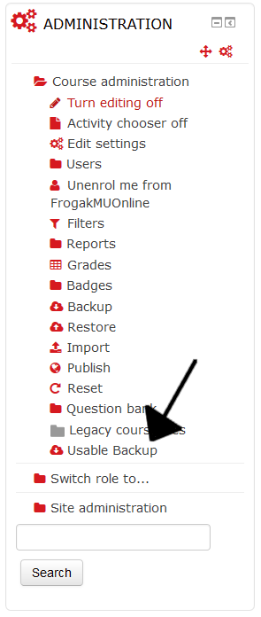

Human Usable Backup
===================

  

## What is this thing?
This is a plugin for those who like to have resources of Moodle courses in their disk, and are tired of downloading each resource one by one.

With a single click, it will create a zip that will contain the following resources of the course from where the download is made:

 - Files.
 - Folders, and files within.
 - URLs, in txt format.

For the moment, the name of the plugin is not definitive.

## Current version
The current release is the v1.0-beta2 (build 2016042600), tested for Moodle 2.9 and 3.0.

#### Remaining tasks to go to v1.0 release candidate
 - Fix [issue #12: Improvable coverage before first stable release: 86,54% of lines - 12/17 in functions and methods](https://github.com/julenpardo/moodle-local_usablebackup/issues/12).
 - Fix [issue #13: create_zip.php, when showing the error message, may show the "Add block" option](https://github.com/julenpardo/moodle-local_usablebackup/issues/13).
 - Fix any other undetected bugs that may arise :speak_no_evil:

## Changes from v1.0-beta1
 - Add the download link to course administration block.

## Installation
 - Go to the local directory of your Moodle installation:
 `cd /wwwroot/local`
 - Clone this repository to a directory named `usablebackup`:
 `git clone https://github.com/julenpardo/moodle-local_usablebackup usablebackup`
 (Or, download directly the [latest release, v1.0-beta2](https://github.com/julenpardo/moodle-local_usablebackup/archive/v1.0-beta2.zip)).
 - Finally, install it from Moodle.
 
## Usage
Just go to the course you want download the resources from, and follow the link in the administration block:

