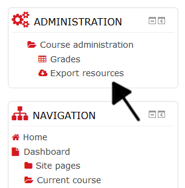

Moodle Resource Exporter
========================

   

## What is this thing?
This is a plugin for those who like to have resources of Moodle courses in their local disk, and are tired of downloading each resource one by one.

With a single click, it will create a zip that will contain the following resources of the course from where the exportation is made:

 - Files.
 - Folders, and files within.
 - URLs, in txt format.

## Current version
The current release, the first stable, is the v1.1 (build 2016052000), tested for Moodle 2.9, 3.0 and 3.1-rc2:
 - For [Moodle 2.9 (v2.9.1.1)](https://github.com/julenpardo/moodle-local_resourceexporter/releases/tag/v2.9.1.1)
 - For [Moodle 3.0 (v3.0.1.1)](https://github.com/julenpardo/moodle-local_resourceexporter/releases/tag/v3.0.1.1)
 - For [Moodle 3.1-rc2 (v3.1.1.1-rc2)](https://github.com/julenpardo/moodle-local_resourceexporter/releases/tag/v3.1.1.1-rc2)

## Changes from v1.0
 - Fix issue "create_zip.php doesn't handle exception when courseid param is a course that does not exist" (see [issue 18](https://github.com/julenpardo/moodle-local_resourceexporter/issues/18)).
 - Add acceptance tests (see [issue 17](https://github.com/julenpardo/moodle-local_resourceexporter/issues/17)).
 - Fix issue "Prechecker errors (not actual errors)" (see [issue 19](https://github.com/julenpardo/moodle-local_resourceexporter/issues/19)).
 - Fix issue "folder_test breaks for Moodle v3.1.0-beta1" (see [issue 20](https://github.com/julenpardo/moodle-local_resourceexporter/issues/20)).

## Upcoming features
 - Allow to export the remaining resources:
  - Books
  - Pages
  - Labels

## Where are the created files stored in the server?
 They are stored in the temporary directory ($CFG->tempdir). So, they will be removed by the "Delete stale temp files" scheduled task (\core\task\file_temp_cleanup_task).

## Installation
 - Go to the local directory of your Moodle installation:
 `cd /wwwroot/local`
 - Clone this repository to a directory named `resourceexporter`:
 `git clone https://github.com/julenpardo/moodle-local_resourceexporter resourceexporter`
 (Or, download directly the [latest master release, v1.0](https://github.com/julenpardo/moodle-local_resourceexporter/archive/v1.0.zip)).
 - Finally, install it from Moodle.

## Usage
Just go to the course you want download the resources from, and follow the link in the administration block:

